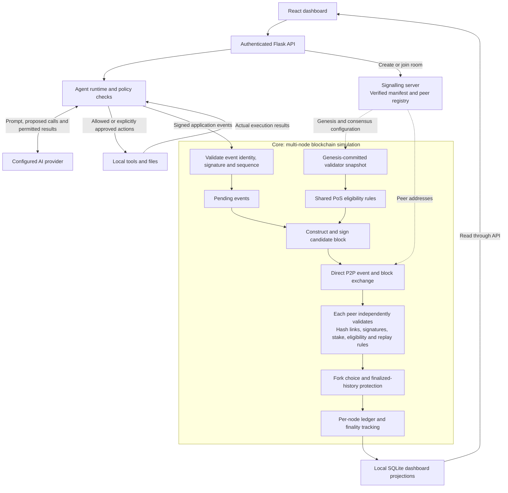

# Certa

**A multi-node Proof-of-Stake blockchain simulation, with a permission-controlled AI workspace as its demonstration application.**

Certa builds on an existing educational blockchain simulator. Its main goals are to correct intentional PoS consensus defects, replace reliance on a predefined bootstrap node with room-based discovery, and make the network observable through a React web interface.

The application layer gives the blockchain real activity to record: users upload files, request work, approve sensitive actions, and inspect signed execution events replicated across nodes. **The AI proposes work; the runtime checks permissions; the blockchain validates and records the shared history.**

Formerly **AgentGuard**. Internal module names and signed protocol identifiers retain that name for compatibility.

## What is implemented

### Blockchain simulation — the core of the project

- Independent local nodes with their own identities, peer connections, pending events and persisted ledgers.
- Shared PoS rules for block production, incoming-block validation and chain synchronization.
- Canonical hashing and domain-separated signatures for consensus and application records.
- Stake-weighted eligibility, authenticated validator snapshots, deterministic fork selection, replay protection and double-signing evidence checks.
- Configurable finality depth, with real empty successor blocks so the last application events can finalize in a quiet room.
- A verified room manifest anchoring genesis, validator allocations and consensus parameters.

### Room-based signalling

Nodes create or join a network using a room ID. The signalling service maintains room manifests and peer membership, with heartbeats and membership expiry. Nodes then exchange events and blocks directly over peer-to-peer connections.

The signalling server helps with discovery; **it does not choose winning validators or accept blocks on behalf of peers**. Nodes still need the signalling endpoint and network-reachable peer addresses. This is not browser WebRTC or automatic NAT traversal.

### Web interface and application layer

- Authenticated operator access to each node.
- Interactive network graph with actual discovered peers and locally observed connections.
- Jobs, approvals, execution trails, security violations and a block inspector.
- Prompt-first tasks through a configured OpenAI-compatible API, plus manual action proposals under Advanced setup.
- Real tools for PDF/text reading, file hashing, CSV-to-SQLite import, read-only SQL and report generation.
- Signed policies with allow, deny and approval-required decisions, plus action, runtime and output limits.
- Downloadable outputs and safely rendered Markdown answers.
- Monochrome responsive interface, collapsible dock, GSAP transitions, cursor-responsive Three.js artwork and reduced-motion support.

There are no seeded jobs, fabricated peers or canned model answers in the application. Operational settings come from the operator's configuration; displayed activity comes from the running services. Test fixtures are isolated to verification code.

## Architecture



The blockchain section represents processing performed independently by participating nodes, not a central block validator. Uploaded file bytes stay local; the ledger carries events, hashes and artifact references rather than distributing all uploaded documents.

## Consensus and integration fixes

| Problem | Implemented correction |
| --- | --- |
| Transaction signatures checked against an independently supplied key | Bind verification to the sender identified in the transaction. |
| Lottery results could vary with randomized signature proofs | Generate deterministic proofs and derive the output from validator identity and epoch seed, independently of signature bytes. |
| Incomplete stake snapshots could distort the lottery | Require exact agreement with the genesis-committed validator registry for room-based validation. |
| Eligibility checks could disagree at the threshold | Share a strict integer comparison: `output × total_stake < validator_stake × 2^256`. |
| Consensus fields were insufficiently bound to block identity | Include consensus-relevant fields in canonical block hashing and signing. |
| Forks and double-signing evidence could be confused | Require the same creator, height and epoch seed, distinct signed hashes and valid signatures for double-signing evidence. Different validators can produce normal competing blocks. |
| Final events could remain unfinalized in a quiet room | Produce real empty successor blocks to advance configured finality. |
| Unicode report approvals produced receipt hash mismatches | Use the same canonical UTF-8 encoder in execution receipts and consensus validation. |

The lottery is an **educational pseudo-VRF**, not a standards-based VRF. Its output is publicly computable from validator identity and seed. This addresses proof-signature grinding, not every adversarial randomness problem.

See [consensus rules](consensus/pos/core.py), [consensus tests](tests/test_pos_core.py) and [real-network execution tests](tests/test_live_finality.py).

## Run locally

You need Python 3.10+, a Node.js version supported by Vite 8, npm and available local ports. From the repository root:

```bash
python -m venv .venv
# Linux/macOS:
source .venv/bin/activate
# PowerShell instead:
# .\.venv\Scripts\Activate.ps1

python -m pip install -r requirements.txt
cd frontend
npm ci

# First use: choose and save network settings interactively.
npm run demo -- --configure .demo-state/operator-profile.json

# Start signalling, nodes, APIs and the website.
npm run demo -- --config .demo-state/operator-profile.json
```

Profile paths resolve from the repository root. Choose the node count, names, balances, reserved stakes, consensus timing and resource limits. At least one validator needs positive stake covered by its genesis allocation; observers can have zero stake.

The launcher prints the actual website URL and a private `operator-access.json` path. Open the URL, select a running node and sign in with its access key. Keep that file out of screenshots and recordings.

**Every launcher invocation starts a fresh room and run directory.** Earlier jobs, keys and files remain on disk but are not loaded into the new room. There is no one-click resume in this launcher. Stop it with Ctrl+C. The [live demo runbook](docs/LIVE_DEMO.md) covers configuration and saved-node operation.

### Configure an AI provider

Create `agent-provider.local.json` in the repository root using [agent-provider.example.json](agent-provider.example.json), without overwriting an existing configured file. Enter your API base URL, tool-capable model ID and API key. Review the resource limits for your documents and tasks.

- Configuration is server-only and gitignored; keys are not bundled into the frontend.
- Restrict access to your account; on Linux/macOS use `chmod 600 agent-provider.local.json`.
- Without a configured provider, AI execution is unavailable; manual tools remain available under Advanced setup.
- OpenRouter configuration and PDF handling are described in the [runbook](docs/LIVE_DEMO.md#openrouter-free-and-pdfs). There is no silent fallback to a paid model or OCR service.

### Demonstrate the workflow

1. Sign in and inspect the real nodes under **Network**.
2. Open **Create job**, attach a text-searchable PDF and ask for a summary and report file.
3. Watch the execution trail populate from actual tool requests and results.
4. Review and approve the report-writing action. Use **Continue agent** when prompted.
5. Download the generated report and inspect its signed receipt.
6. Open **Ledger** to inspect included events and finality. Sign in on another node to inspect the replicated history.

Genesis at height zero is the network's starting configuration, not a previously executed job. **Running / Finalized** can still mean a job is waiting on the model: finalized describes its recorded history, not completion of all requested work.

## Verification

With the virtual environment active, from the repository root:

```bash
python -m pytest -q
cd frontend
npm run check
```

For browser tests, start an isolated real network using `python -m tests.live_server --ready-file <new-private-access-file>`, then set `AGENTGUARD_LIVE_ACCESS` to that file before running `npm run test:e2e` in `frontend`. Browser installation and environment details are in the [runbook](docs/LIVE_DEMO.md#verify-without-browser-mocks).

The latest pre-merge verification on the development Linux host passed **154 Python tests, 14 frontend unit tests and 6 desktop/mobile browser tests**, plus type checking, linting and production build. The hosted-model smoke test is opt-in and skipped in the ordinary suite. These results are a development snapshot, not a guarantee for every platform or external provider.

Browser tests use real APIs and peers: upload, approval, hashing, download, denial and multi-node finality. Protocol unit tests may use isolated test doubles; production does not use them as fallback services.

## Limitations and data handling

- This is an educational simulation for trusted local demonstrations, not production blockchain security or a distributed LLM inference engine.
- A signature authenticates a record's signer. Consensus on a receipt does not independently prove honest remote execution or factual correctness of an AI answer.
- Room participants can see recorded instructions, action arguments, decisions and artifact metadata. Keep secrets out of these fields.
- Uploaded files stay on their hosting node, but prompts and permitted tool results—including extracted text—are sent to the configured AI provider. Run file-based work on the input-hosting node; automatic private file transfer is not implemented.
- PDF support reads the text layer with explicit continuation cursors. Scans, handwriting and image interpretation require OCR; table layout may be imperfect. Large documents remain subject to configured budgets.
- Model calls run in a synchronous tool loop, with node write commands serialized. There is no durable background queue or cancel button. Provider latency and rate limits can delay a run; the request timeout is not a total job deadline. Inspect an existing task before retrying an interrupted request.
- Sign-in grants operator control of a node, not a separate multi-user account. Do not expose development servers publicly without TLS, access controls and deployment hardening.

## AI-use disclosure

AI coding assistance, including **OpenAI Codex**, was used during development for implementation, debugging, test creation, frontend iteration, documentation and demo-script preparation. This repository should not be represented as entirely hand-written without AI assistance. Maintainers remain responsible for understanding, reviewing and explaining the implementation and its limitations; AI assistance and passing tests are not substitutes for an independent security audit.

Separately, Certa uses an operator-configured language model **at runtime** to propose actions and generate answers. Model output is not trusted authorization: the runtime checks tool requests against the job's policy and requires approval where specified. Generated prose can still be inaccurate and should be reviewed.

## Repository guide

| Path | Purpose |
| --- | --- |
| `consensus/pos/` | PoS rules, block/event validation, networking and ledger behaviour |
| `signalling/` | Room manifests, membership and discovery API |
| `agentguard/` | Runtime, policies, tools, authentication, artifacts and projections |
| `api/` | Node API and service composition |
| `contracts/` | Shared JSON schemas and OpenAPI contract |
| `frontend/` | React application, unit tests and browser tests |
| `scripts/` | Demo launcher and development entry points |
| `tests/` | Consensus, runtime and integration verification |
| `docs/`, `verification/` | Runbooks, design notes and verification records |

Useful references: [live demo](docs/LIVE_DEMO.md), [technical stack](TECH_STACK.md), [schemas](docs/SCHEMAS.md), [API contract](docs/API_CONTRACT.md) and [implementation plan](PLAN.md). Earlier planning documents use the AgentGuard name and historical milestones; the current runbook documents the supported demo workflow.

## Original simulator and attribution

The repository retains the original terminal simulator, including PoW, PoA, educational contract execution and IPFS-related code. These are legacy paths, not the scope of the current Certa web demonstration. Certa's file tools use local artifact storage rather than requiring IPFS. The original terminal entry point is `python start_peer.py`.

Original simulator authors credited in this repository:

- **Rahan M** — [GitHub](https://github.com/Rahan-M)
- **Jefin Joji** — [GitHub](https://github.com/JefinCodes)

Certa extends that foundation with consensus fixes, room-based discovery and the execution workspace. Repository history records the implementation contributions.
